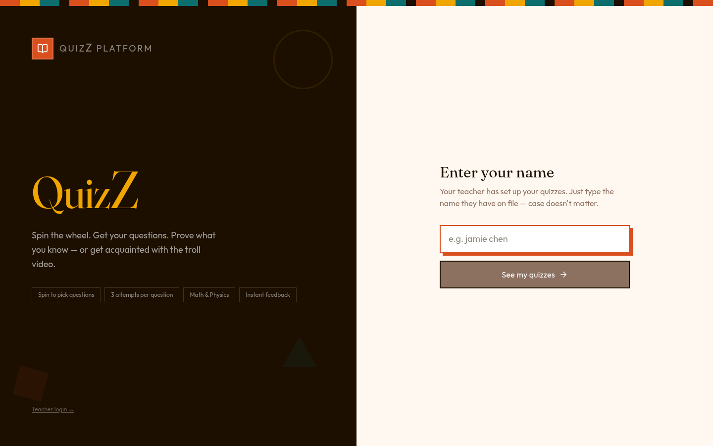
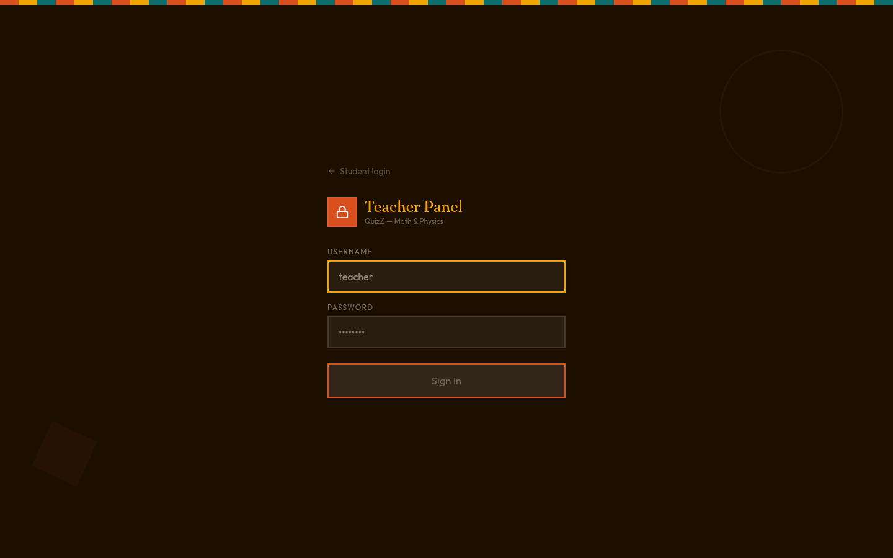

# QuizZ Platform

Math & Physics quiz site for students — spin a wheel, get questions, prove what you know (or meet the video).

Built with **React 19 + Vite + Tailwind v4** on the frontend and **FastAPI + MongoDB** on the backend.



## What it does

**Students** enter their name (case-insensitive), pick from the quizzes their teacher has assigned, spin a wheel to pick a question, and answer with instant feedback — KaTeX-rendered math, three attempts per question, and a results screen at the end.

**Teachers** log in to a dedicated panel to manage students, categories, lessons, quizzes, questions, media assets, motivational quotes, and reports. Username + password are editable from the Security page.



## Stack

| Layer    | Tech                                                              |
| -------- | ----------------------------------------------------------------- |
| Frontend | React 19, Vite 8, Tailwind v4, React Router, KaTeX, GSAP          |
| Backend  | FastAPI, Motor (async MongoDB), Pydantic v2, JWT auth             |
| Storage  | Cloudflare R2 (free tier) for media uploads                       |
| Deploy   | Vercel (frontend) · Render (backend) · MongoDB Atlas (free tier)  |

Full deploy guide: [`DEPLOY.md`](DEPLOY.md). Math syntax reference: [`MATH-IN-QUESTIONS.md`](MATH-IN-QUESTIONS.md).

## Run locally

```bash
# Frontend (Vite on :8443)
pnpm install
pnpm run dev

# Backend (FastAPI on :8000)
cd backend
python -m venv .venv && . .venv/bin/activate
pip install -r requirements.txt
uvicorn app.main:app --host 127.0.0.1 --port 8000 --reload
```

Vite proxies `/api/*` to `:8000`, so the frontend hits one origin in dev.

## Project layout

```
src/                 React app — routes, pages, components, store, API client
backend/app/         FastAPI app — routers, schemas, auth, MongoDB layer
docs/screenshots/    README + release artwork
DEPLOY.md            Vercel + Render + Atlas walkthrough
MATH-IN-QUESTIONS.md KaTeX syntax for question prompts
vercel.json          SPA rewrite config
render.yaml          Render Blueprint
```

See [`AGENTS.md`](AGENTS.md) for the canonical file map and conventions.

## Highlights

- **Wheel-driven question selection** — server re-derives the served set from `quizId + wheelResult`, so the client can't peek
- **Stale-while-revalidate** progress panel — no loading flash on re-entry
- **Parallelized admin reports** — single class report + per-student reports fetched in parallel
- **Case-insensitive student login** — name match is regex-escaped server-side
- **Cloudflare R2 uploads** — persistent media on the free tier
- **Mobile-compact admin** — full sidebar collapses below 768px

## License

Private project. All rights reserved by the author.